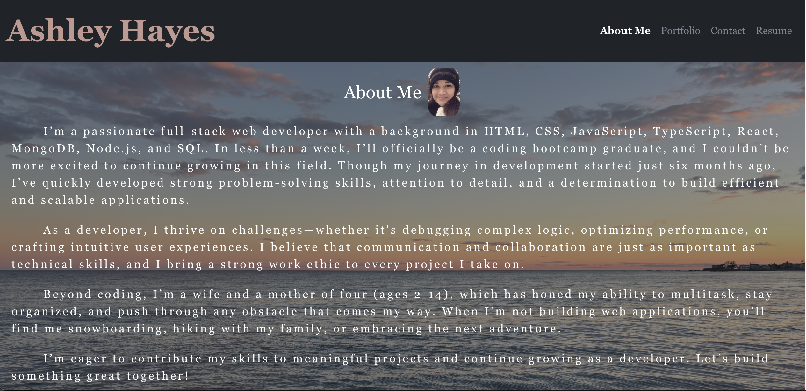

# Ashley Hayes Portfolio

## Description

This is my Portfolio page as a Web Developer, to showcase my skills and talents. As a soon-to-be bootcamp graduate, it is a work in progress. It includes an About Me section, a Portfolio with 6 examples of my work, a contact form and a page to download my resume. 

## Usage

This Portfolio is deployed with Netlify and can be viewed at [Netlify Link](https://ashley-hayes-portfolio.netlify.app/).

The home page loads the About Me section, and you can navigate to each of the other 3 sections of the page by clicking on the links in the top left navbar. 

On the "Portfolio" page, you can click on with the deployed link or the GitHub repository link for each project. 

On the "Contact" page you can either complete the form to send me an email (COMING SOON!) or you can simply email me directly with the address provided at the bottom. 

On the "Resume" page, you will find a list of highlighted, but not exhaustive, proficiencies as well as a link to download my resume. 

